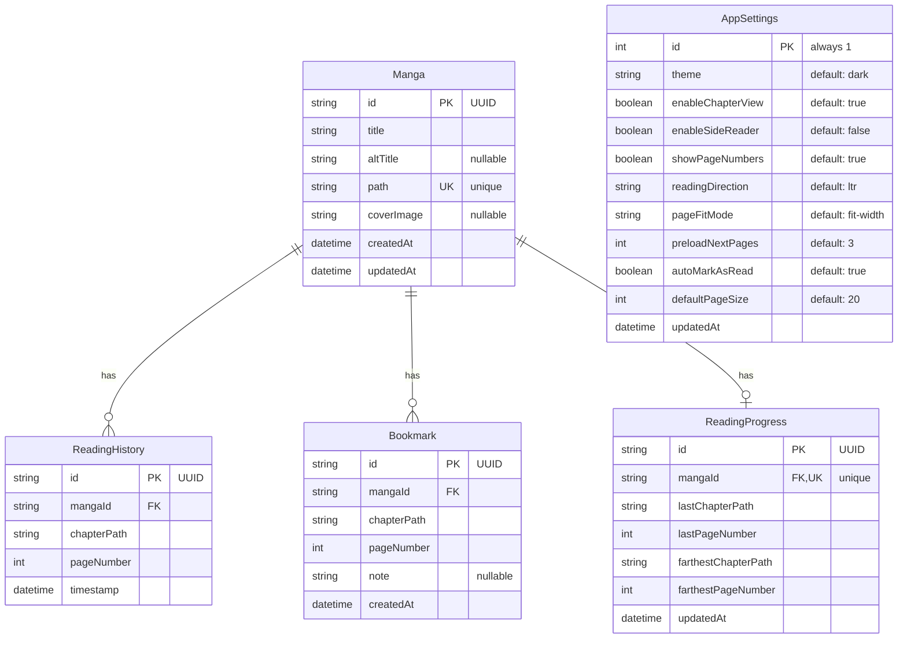

# Entity Relationship Diagram

This diagram represents the database schema for the Manga Reader application.

## Relationships

- **Manga → ReadingHistory**: One-to-Many (A manga can have multiple reading history entries)
- **Manga → Bookmark**: One-to-Many (A manga can have multiple bookmarks)
- **Manga → ReadingProgress**: One-to-One (A manga has one reading progress record)
- **AppSettings**: Singleton table (Only 1 row with id=1, pre-seeded on database initialization)

## Notes

- All foreign key relationships have `onDelete: Cascade` - deleting a manga will delete all associated records
- Indexes are created on:
  - `ReadingHistory`: mangaId, timestamp
  - `Bookmark`: mangaId
  - `ReadingProgress`: mangaId (unique)

## AppSettings Details

The AppSettings table stores application-wide preferences:

### UI Settings
- **theme**: Color theme (`dark`, `light`, `auto`)
- **enableChapterView**: Show/hide chapter view in reader
- **enableSideReader**: Open manga in drawer vs side panel
- **showPageNumbers**: Display page numbers while reading

### Reading Settings
- **readingDirection**: Reading flow direction (`ltr` for Western comics, `rtl` for manga)
- **pageFitMode**: How pages are displayed (`fit-width`, `fit-height`, `original`)
- **preloadNextPages**: Number of pages to preload ahead
- **autoMarkAsRead**: Automatically mark chapters as read when completed

### Pagination Settings
- **defaultPageSize**: Default number of items per page in lists
